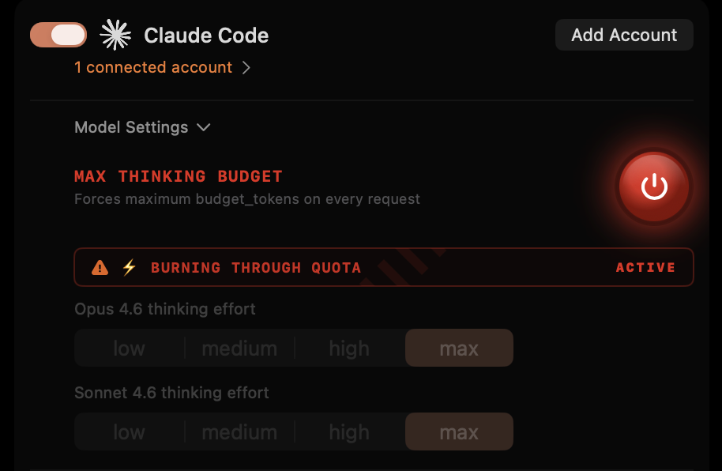
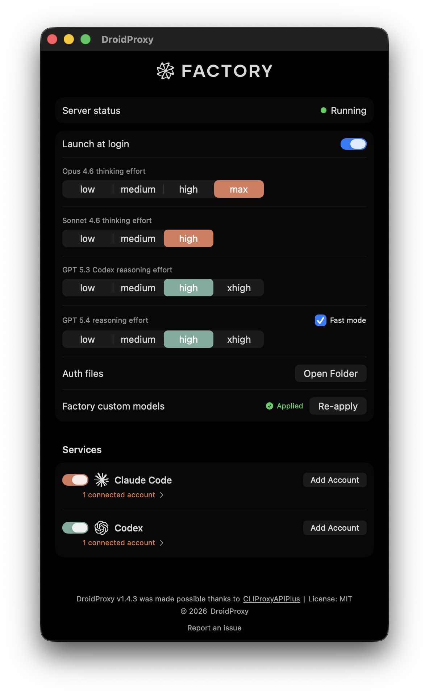

# DroidProxy

<p align="center">
  
</p>

A native macOS menu bar app that proxies Claude Code, Codex, and Gemini authentication for use with AI coding tools like [](https://app.factory.ai) Droids. Built on [CLIProxyAPIPlus](https://github.com/router-for-me/CLIProxyAPIPlus).

## Download

Grab the latest release from [Releases](https://github.com/anand-92/droidproxy/releases/latest):

- **DroidProxy-arm64.dmg** -- Apple Silicon
- **DroidProxy-arm64.zip** -- ZIP alternative

All releases are code-signed and notarized by Apple. Existing installs auto-update via Sparkle.

## Features

- **One-click OAuth auth** -- Claude Code, Codex, and Gemini login from the menu bar, credential monitoring, auto-refresh
- **Adaptive thinking proxy** -- Injects `thinking: {"type":"adaptive"}` and per-model `output_config.effort` for Claude Opus 4.6 and Claude Sonnet 4.6 requests sent through `http://localhost:8317`
- **Codex reasoning controls** -- Injects `reasoning: {"effort":"..."}` for `gpt-5.3-codex` and `gpt-5.4` via the OpenAI-compatible `http://localhost:8317/v1` endpoint
- **Gemini thinking levels** -- Injects per-model thinking levels for `gemini-3.1-pro-preview` (`low` / `medium` / `high`) and `gemini-3-flash-preview` (`minimal` / `low` / `medium` / `high`) via model name suffix rewriting
- **Per-model effort controls** -- Configure Opus 4.6 (`low` / `medium` / `high` / `max`), Sonnet 4.6 (`low` / `medium` / `high`), GPT 5.3 Codex (`low` / `medium` / `high` / `xhigh`), GPT 5.4 (`low` / `medium` / `high` / `xhigh`), Gemini 3.1 Pro (`low` / `medium` / `high`), and Gemini 3 Flash (`minimal` / `low` / `medium` / `high`) directly from the Settings window
- **Max Budget Mode** -- Nuclear launch button that forces maximum `budget_tokens` on every Claude request. Engages full thinking power at the cost of burning through your API quota at warp speed. You've been warned.

<p align="center">
  
</p>

- **Sparkle auto-updates** -- Checks daily, installs in the background
- **Factory integration** -- Use Claude models against `http://localhost:8317`, Codex/OpenAI models against `http://localhost:8317/v1`, and Gemini models against `http://localhost:8317/v1`

## Setup

See [SETUP.md](SETUP.md) for authentication and Factory configuration instructions.

<p align="center">
  
</p>

## Requirements

- macOS 13.0+ (Ventura or later)
- Apple Silicon (M1/M2/M3/M4)

## Build from source

```bash
# Debug build
make build

# Release build + signed .app bundle
./create-app-bundle.sh
```

## Project Structure

```
src/
├── Sources/
│   ├── main.swift              # App entry point
│   ├── AppDelegate.swift       # Menu bar & window management
│   ├── ServerManager.swift     # Server process control & auth
│   ├── SettingsView.swift      # Main UI
│   ├── AuthStatus.swift        # Auth file monitoring
│   ├── ThinkingProxy.swift     # Thinking parameter injection proxy
│   ├── TunnelManager.swift     # Network tunnel management
│   ├── IconCatalog.swift       # Icon loading & caching
│   ├── NotificationNames.swift # Notification constants
│   └── Resources/
│       ├── cli-proxy-api-plus  # CLIProxyAPIPlus binary
│       ├── config.yaml         # Server config
│       ├── AppIcon.icns        # App icon
│       ├── icon-active.png     # Menu bar icon (active)
│       ├── icon-inactive.png   # Menu bar icon (inactive)
│       ├── icon-claude.png     # Claude service icon
│       ├── icon-codex.png      # Codex service icon
│       └── icon-gemini.png     # Gemini service icon
├── Package.swift
└── Info.plist
```

## Challenger Droids

DroidProxy ships with three devil's advocate code reviewer droids -- powered by Claude Opus 4.6, GPT 5.4, and Gemini 3.1 Pro. They challenge your code decisions, surface tradeoffs you may have missed, stress-test edge cases, and suggest concrete alternatives. Running multiple gives you a cross-model second opinion that catches blind spots a single reviewer might miss.

### Install

Copy the droid and command definitions into your personal Factory config:

```bash
mkdir -p ~/.factory/droids ~/.factory/commands

# Droids
cp .factory/droids/challenger-opus.md ~/.factory/droids/
cp .factory/droids/challenger-gpt.md ~/.factory/droids/
cp .factory/droids/challenger-gemini.md ~/.factory/droids/

# Slash commands
cp .factory/commands/challenge-opus.md ~/.factory/commands/
cp .factory/commands/challenge-gpt.md ~/.factory/commands/
cp .factory/commands/challenge-gemini.md ~/.factory/commands/
```

### Usage

In any Droid session, use the slash commands:

- `/challenge-opus` -- summon the Claude Opus 4.6 challenger
- `/challenge-gpt` -- summon the GPT 5.4 challenger
- `/challenge-gemini` -- summon the Gemini 3.1 Pro challenger

Both droids are read-only (no file edits) and return a structured verdict with challenges, edge cases, and acknowledgements of what's solid.

## Star History

<a href="https://starchart.cc/anand-92/droidproxy">
  <picture>
    <source media="(prefers-color-scheme: dark)" srcset="https://starchart.cc/anand-92/droidproxy.svg?theme=dark">
    
  </picture>
</a>

## License

MIT
